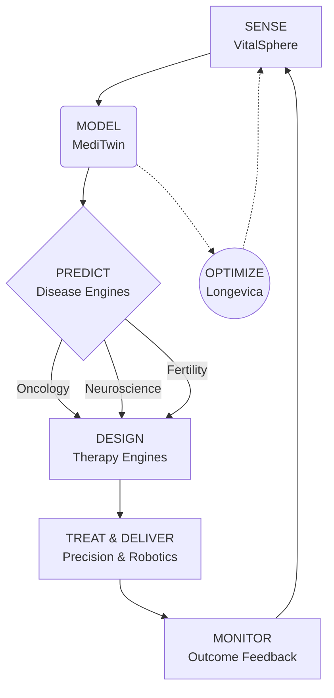

# **BIOINFINITY HEALTHOS**
### *The Limitless AI Ecosystem for Healthcare, Biotech, and Longevity*

---

> **Our Mission:**
> Sense every human. Model every body. Predict every disease. Design every therapy. Deliver every intervention. Learn from every outcome.

---

## 🌍 **THE VISION: A UNIFIED HEALTHCARE CIVILIZATION**

The era of fragmented healthcare—where diagnostics, drug discovery, and treatments live in silos—is over. 

**BioInfinity HealthOS** is not a collection of separate startups. It is one unified healthcare intelligence ecosystem. A continuous loop of sensing, modeling, predicting, designing, and acting that compounds in intelligence with every patient it touches.

We are building the **world model of human health.**

---

## ⚙️ **THE SELF-IMPROVING INTELLIGENCE FLYWHEEL**

Our ecosystem operates on a continuous, self-improving loop. It never stops learning.

---

## 🧬 **THE ECOSYSTEM MODULES**

Ten specialized intelligence engines. One shared data spine.

### **1. THE SENSORY LAYER**
* **VitalSphere** | *Continuous Health Sensing*
  The input layer of human existence. Ingesting everything from real-time wearables, blood biomarkers, and sleep data to genomics, microbiome, and clinical records. Without VitalSphere, intelligence remains theoretical. We capture reality.

### **2. THE LIVING MODEL**
* **MediTwin** | *Real-Time Human Digital Twin*
  The core intelligence layer. MediTwin constructs a highly precise digital replica of your body, mapping organ-level models, disease risks, aging trajectories, and simulating therapeutic interventions before they ever touch your physical self.

### **3. THE DISEASE EXPERT SYSTEMS**
* **OncoMind Systems** | *Cancer Intelligence*
  Scanning for the faintest oncological signals, predicting tumor evolution, and architecting precision eradication plans.
* **NeuroBloom AI** | *Cognition & Brain Intelligence*
  Modeling brain aging, preempting neurodegenerative decline, and orchestrating cognitive repair strategies.
* **FertiliGen** | *Reproductive Optimization*
  Predicting fertility trajectories, assessing embryo viability, and safeguarding maternal-fetal health.

### **4. THE THERAPY CREATORS**
* **GenomeForge AI** | *Genomic & Cellular Design*
  Architecting personalized gene therapies, CRISPR edits, and cellular interventions to repair biology at its source code.
* **PharmaVerse AI** | *Biological Simulation & Drug Discovery*
  Discovering new molecules and protein targets by simulating billions of biological pathways, eliminating the guesswork of traditional drug trials.

### **5. THE PRECISION INTERVENTION LAYER**
* **NanoCure Intelligence** | *Targeted Therapeutic Delivery*
  Determining exactly *where*, *when*, and *how much* therapy to deliver. Orchestrating smart injectable therapeutics and programmable nanomedicine to maximize impact and minimize collateral damage.
* **AutoSurg Robotics** | *Robotic Action Engine*
  Translating intelligence into physical reality. Minimally invasive microscale precision surgeries executed with AI guidance.

### **6. THE MASTER ORCHESTRATOR**
* **Longevica** | *Total Lifespan Optimization*
  Managing total healthspan, not just disease. Longevica ingests the totality of system data to track biological age, optimize prevention, and coordinate regenerative therapies to slow decline and extend human vitality.

---

## 🧠 **THE SHARED TECHNOLOGY BACKBONE**

BioInfinity is powered by the **Unified Health Graph**—a secure, interconnected web linking genes, proteins, diseases, lifestyles, and outcomes. 

This graph is interpreted by an orchestra of multimodal foundation models:
* **The Clinical Model:** Deciphers medical histories and diagnoses.
* **The BioModel:** Understands cellular pathways and genomics.
* **The Sensor Model:** Interprets real-time physiological data streams.
* **The Imaging Model:** Reads MRIs, CTs, and pathology at pixel-perfect resolution.
* **The Simulation Engine:** Runs millions of patient-specific treatment scenarios.
* **The Robotics Control Model:** Guides precise, human-in-the-loop surgical interventions.

---

## 🚀 **LIMITLESS COMPOUNDING**

BioInfinity HealthOS is practically limitless. 
Every patient improves the system. Every disease becomes computable. Every layer reinforces the others. 

We are expanding healthcare from a reactive discipline of curing sickness to a proactive science of total human optimization. 

**Welcome to the Operating System of Human Health.**

 

  <button style="padding: 15px 30px; font-size: 18px; font-weight: bold; background-color: #0070f3; color: white; border: none; border-radius: 5px; cursor: pointer;">
    INITIALIZE YOUR MEDITWIN
  </button>

